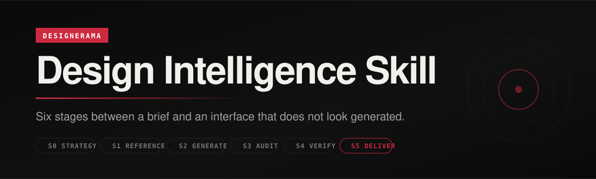

<p align="center">
  
</p>

<h1 align="center">Design Intelligence Skill</h1>

<p align="center">
  <em>Six stages between a brief and an interface that does not look generated.</em>
</p>

<p align="center">
  <a href="LICENSE"></a>
  &nbsp;
  <a href="https://github.com/vercel-labs/agent-skills"></a>
  &nbsp;
  <a href="#install"></a>
  &nbsp;
  <a href="CHANGELOG.md"></a>
</p>

Most AI design tooling is a pile of skills with no opinion about when to use which one. This is the opposite: an **orchestrator** that reads your task and routes it through six stages in order, so reference work happens before generation and verification happens before you call it done.

The stages are the product. The skills are swappable.

<p align="center"><sub><a href="#install">Install</a> · <a href="#the-six-stages">Stages</a> · <a href="#whats-in-this-repo">Skills</a> · <a href="#which-one-should-i-use">Which one</a> · <a href="#the-decision-ledger">Ledger</a> · <a href="#the-wider-ecosystem">Ecosystem</a> · <a href="#common-questions">FAQ</a> · <a href="#license">License</a></sub></p>

---

## Install

```bash
git clone https://github.com/Verifux/Design-Intelligence-Skill.git ~/.claude/plugins/design-intelligence
```

Or drop a single `SKILL.md` into `~/.claude/skills/` and use it on its own. Every skill here is a standalone portable file with no build step and no runtime.

Then start any design session with the orchestrator:

```
/design-intelligence build a landing page for a B2B SaaS tool
```

It reads the task, picks the stage, and pulls in the right skill. You do not have to remember the map.

---

## The six stages

| Stage | Name | Job | Default skill |
|---|---|---|---|
| **S0** | Strategy | What should the words say? Weak-vs-strong test before a line of copy is written | `/taste-arbitrage` |
| **S1** | Reference | Extract type, palette, and layout signals from real work before building | Public galleries, Refero |
| **S2** | Generate | Build with the constraints from S0 and S1 already in hand | `/evidence-led-frontend`, 21st |
| **S3** | Audit | For existing builds, diagnose before you touch anything | `/evidence-led-frontend` audit pass |
| **S4** | Verify | Post-flight. A build is not done because it renders | `impeccable` |
| **S5** | Deliver | Ship it in the right format | `scroll-world`, toolkit |

**Anti-skipping rule.** Do not invoke S2 without running S0 and S1. Do not call a build done without S4. Every skipped stage is quality debt that surfaces in production, usually in front of a client.

**Convergence rule.** Where two or more tools independently flag the same issue, that is the real signal. Act on it. Where only one does, investigate before you rewrite anything.

---

## What's in this repo

The `Install name` column is the value you pass to `--skill`, and the name you type as a slash command.

Everything here is original to this project. Nothing is vendored in from another repo.

| Skill | Install name | What it does |
|---|---|---|
| **orchestrator** | `design-intelligence` | The entry point. Reads a task, routes it to the right stage, enforces the anti-skipping rule. Start here. |
| **evidence-led-frontend** | `evidence-led-frontend` | S2. Builds landing pages and portfolios where every decision traces to a measured reference value or a named audit checkpoint, and emits the trail as a decision ledger before the code. |
| **taste-arbitrage** | `taste-arbitrage` | S0. Copy and positioning. Runs any line through a five-question weak-vs-strong test. Built on the thesis that AI commoditised execution, so judgment is the scarce skill and the copy should show the decision trail, not the artefact. |
| **mastery-loop** | `mastery-loop` | Session operating system. Observe, extract, encode, apply, measure, repeat. Names the failure patterns directly: planning-as-avoidance, waiting for perfect conditions, silent stall. |

### Why evidence-led-frontend is different

Most anti-slop skills are a list of preferences. A model's preferences are the statistical centre of everything it has seen, and the centre is the slop, so a preference list fights the problem with the thing causing it.

This one allows exactly two sources for any decision:

- **A measured value.** Real numbers pulled off live sites with a script, not recalled. Four standing references measured on 2026-07-26: display type running **101px to 172px**, not one using Inter, not one using pure black or pure white, and a single hot accent or none at all.
- **A named checkpoint.** Real IDs from the MX/BX/AIX framework (`acc_01`, `cvr_03`, `aix_04` and the rest), the same ones a [Verifux](https://verifux.app) audit scores against.

Anything with neither source is a default wearing a decision's clothes. The skill makes the agent write the ledger **before** the code, which is also what makes the output defensible in front of a client rather than just pretty.

---

## Which one should I use?

- Starting any design session at all, reach for **`/design-intelligence`** and let it route. That is the whole point of it.
- Writing or reviewing **words** (positioning, a case study, a proposal), use **`/taste-arbitrage`** before you design anything around them.
- Building a **new landing page or portfolio**, use **`/evidence-led-frontend`**.
- Working on **something that already exists**, still use **`/evidence-led-frontend`**, but let it audit before it touches anything. Generating first is how a redesign quietly becomes a rewrite.
- Wanting a **specific visual language** rather than a method (brutalist, minimalist, high-end), install the taste-skill presets in the ecosystem section. They cover style; this repo covers sequence.
- Reviewing **how you work** rather than what you built, use **`/mastery-loop`** at the start or end of a session.

Scope limit worth stating plainly: `evidence-led-frontend` covers landing pages, portfolios, marketing sites, and overhauls of those. It does not cover dashboards, data tables, or multi-step product UI. Those have mature systems already (Fluent, Carbon, Atlassian) that encode years of decisions this skill would actively fight.

---

## The decision ledger

`evidence-led-frontend` emits this table **before** it writes any code. Every row is `measured` or `checkpoint`. There is no third category, and anything that fits neither has to be declared as an assumption out loud.

| Decision | Value | Source | Type |
|---|---|---|---|
| Display face | Cabinet Grotesk | No standing ref uses Inter; one face, own voice | measured |
| Display size | 108px | Standing refs measure 101 to 172px | measured |
| Ground | `#0F0E0D` | Refs never use pure black; warm-tinted | measured |
| Accent | `#EA3718`, used 3 times | One hot accent, frequency not hue | measured |
| CTA position | Above fold, single primary | `cvr_01` CTA hierarchy | checkpoint |
| Focus ring | 2px, 3:1 on both grounds | `acc_02` focus indicators | checkpoint |

Two or three assumptions on a page is normal. Twelve means the agent is designing from defaults and calling it a ledger.

It also opens with the read, one sentence, before anything else: *"Reading this as a [page kind] for [audience], where the visitor's single next action is [action], and the thing that must land in the first viewport is [claim]."* Getting that sentence wrong is cheap. Getting it wrong silently, after 400 lines of CSS, is not.

---

## The wider ecosystem

None of this is bundled. Install what you actually need.

```bash
# Taste-skill family. One command, twelve skills, including style presets
# (minimalist, brutalist, high-end) and image-generation skills
npx skills add Leonxlnx/taste-skill

# 21st.dev: explore directions, sketch UI, build production components.
# Re-run the same command later to update them
npx @21st-dev/cli install-skill

# Refero: research-first method, plus live search of real shipped product UI
npx skills add https://github.com/referodesign/refero_skill --skill refero-design
claude mcp add --transport http refero https://api.refero.design/mcp \
  --header "Authorization: Bearer <your-key>"

# Cinematic scroll landing pages (S5)
claude plugin add oso95/scroll-world

# Tool selection reference, 70+ frontend tools by task (S5)
claude plugin add wilwaldon/Claude-Code-Frontend-Design-Toolkit
```

**Install location matters.** `npx skills add` writes to `.agents/skills/` relative to the directory you run it in, then symlinks into Claude Code. Run it from two different folders and you get two different skill sets. `claude mcp add` behaves the same way unless you pass `-s user`.

---

## Reference sources

`references/public-gallery-sources.md` carries extraction guides for four public galleries:

| Source | What to pull from it |
|---|---|
| **Awwwards** | Layout composition, type pairings, motion patterns. Filter by industry, not Site of the Day. A B2B winner beats an agency showpiece. |
| **Dribbble** | Palette ideas and single component details. Never a full page layout. Shots are pictures of interfaces, not interfaces: no empty states, no real content. |
| **CSS Design Awards** | Production-quality interaction, with published per-entry criteria so you can read why something scored. |
| **Mobbin** | Mobile-first patterns, onboarding flows, real product UI states. |

Extraction method: pick three sites, and for each note the font family, type scale, primary plus neutral colour, layout family, and motion signature. Extract the system. Never copy the markup.

---

## What this is not

- Not a component library. There is no code to import.
- Not a dashboard or data-UI system. Use Fluent, Carbon, or Atlassian.
- Not a Figma plugin.
- Not a replacement for judgment. It routes the work and enforces the order. It cannot tell you whether the idea was worth building.

---

## Common questions

**How is this different from the other AI design skills?**
Most of them are a single skill with strong opinions about aesthetics. This is an orchestrator with strong opinions about *sequence*. It is designed to sit on top of skills like taste-skill and 21st rather than compete with them.

**Do I need all the peer dependencies?**
No. The four skills here run standalone. The ecosystem section is there so the orchestrator has something real to route to at each stage.

**Does it work outside Claude Code?**
Yes. Every skill is a portable `SKILL.md`. Codex, Cursor, and anything else that reads agent skills can use them, and you can paste one into a chat directly.

**Why is the em dash banned?**
It is one of the most reliable tells of unedited model output. The rule is enforced in the skills and held to in this README.

**How does this relate to taste-skill?**
They solve different halves. [taste-skill](https://github.com/Leonxlnx/taste-skill) gives you visual languages: brutalist, minimalist, high-end. This gives you a method and an evidence trail. They compose well, and earlier versions of this repo vendored two of its skills before `evidence-led-frontend` replaced that need. Install it alongside if you want the style presets.

---

## Credits

The orchestrator, `taste-arbitrage`, and `mastery-loop` are original work by [Kishan Rama](https://designerama.co.za) / Designerama.

The measured reference values come from original extraction runs against four live sites, and the checkpoint IDs come from the [Verifux](https://verifux.app) MX/BX/AIX framework.

The structure of this README follows [Leonxlnx/taste-skill](https://github.com/Leonxlnx/taste-skill), which is a good piece of open-source documentation and worth saying so.

---

## License

[MIT](LICENSE) © 2026 Kishan Rama / Designerama.

Everything in `skills/` is original to this project. Tools named in the ecosystem section are installed separately and keep their own licenses, listed in [THIRD-PARTY-NOTICES.md](THIRD-PARTY-NOTICES.md).
